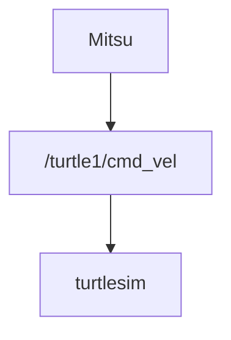

# `zse_exn_ajr` package
ROS 2 python package, that draws a Mitsubishi logo using Turtlesim, it consists of a single node, that publishes a geometry_msg/Twist topic. ROS2 Humble.  [](https://docs.ros.org/en/humble/)
## Packages and build

It is assumed that the workspace is `~/ros2_ws/`.

### Clone the packages
``` r
cd ~/ros2_ws/src
```
``` r
git clone https://github.com/zsedelypeter/zse_exn_ajr
```

### Build ROS 2 packages
``` r
cd ~/ros2_ws
```
``` r
colcon build --packages-select zse_exn_ajr --symlink-install
```

<details>
<summary> Don't forget to source before ROS commands.</summary>

``` bash
source ~/ros2_ws/install/setup.bash
```
</details>

``` r
ros2 launch zse_exn_ajr MitsuLaunch.launch.py
```



